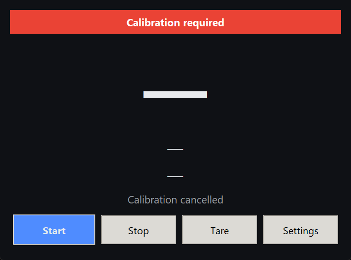
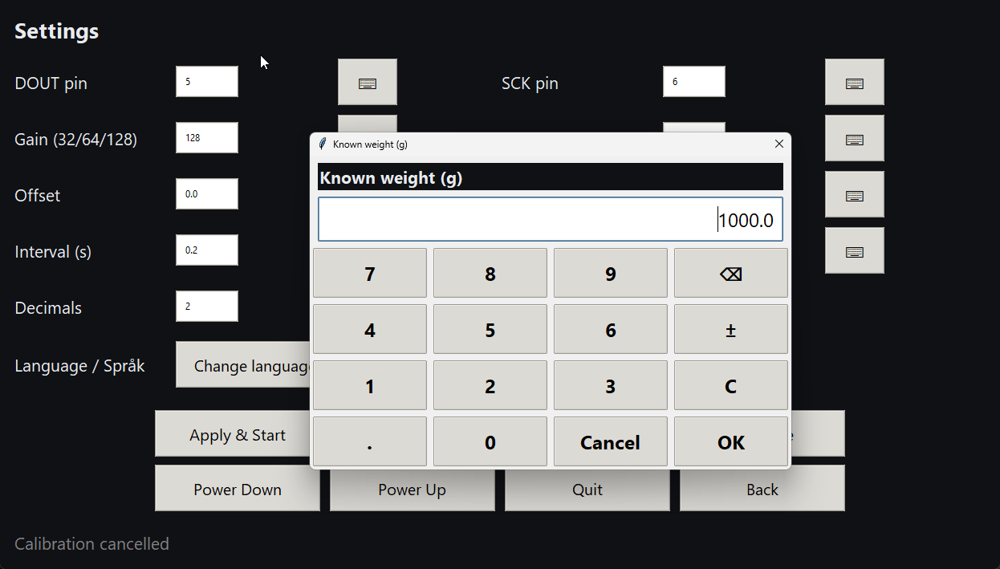
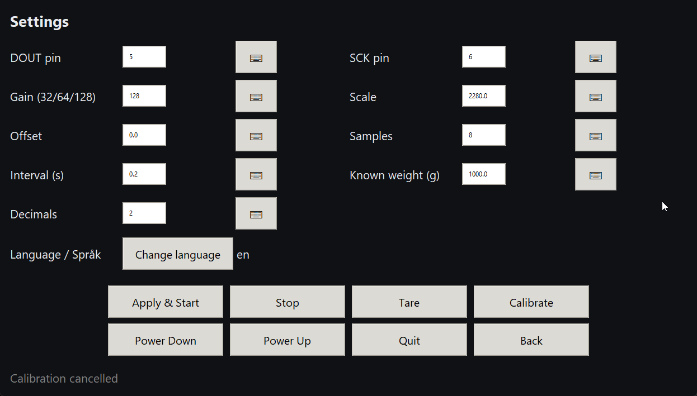

# HX711 Load Cell UI (Qt Quick, Raspberry Pi)

Modern, macOS-inspired HX711 scale UI (Qt Quick / PySide6) with background
readings, JSON-based i18n, and a reusable HX711 device module.

## Quick start

- Install deps: `pip install -r requirements.txt`
- Desktop (macOS-like Qt UI): `python main.py` (add `--demo` to preview without hardware)
- Raspberry Pi with HX711:  
  `sudo apt install python3-gpiozero`  
  `pip install -r requirements.txt`  
  Wire HX711 (DT/DOUT -> GPIO 5, SCK -> GPIO 6, VCC -> 3V3/5V, GND -> GND)  
  `python main.py`
- Fullscreen (Qt): toggle green stoplight or press the platform fullscreen shortcut.

## UI overview (Qt Quick, macOS-inspired)

- Clean main view with oversized grams, Newtons, raw count, Hz, and a pill-style
  calibration banner (green/amber/red).
- Primary actions: Start, Stop, Tare, Calibrate, Settings.
- Right-edge drawer for settings (numeric fields stay simple, desktop-friendly):
  - Pins: DOUT, SCK; Gain (32/64/128)
  - Scale, Offset (persisted)
  - Samples (average count), Interval (seconds)
  - Known weight (grams) for calibration
  - Decimals displayed (0+)
  - Rolling-window smoothing toggle
  - Save, Apply & Start
- Demo mode (`--demo`) to try the UI without HX711 hardware.

## Screenshots

- Main view  
  
- Popup numpad  
  
- Settings  
  

## Calibration (simplified in Qt UI)

1) In Settings, set pins/gain if needed and enter a known weight in grams
   (e.g., 1000 for 1 kg).
2) Place that weight on the scale, then tap **Calibrate** (main view).  
   - The app zeroes, measures, computes scale, and stores offset/scale/time.
   - If the measured delta is invalid/zero you’ll see an error and nothing is saved.
3) Tap **Apply & Start** to resume live readings.
4) The banner will warn (amber/red) if calibration is stale (age) or missing.

## Tare

- Tap **Tare** (main or settings). Runs async; applies a session-only tare offset that
  does **not** change the calibrated offset. Calibrate or restart reading to clear tare.

## Language / i18n

- JSON files in `languages/*.json` (ships with `en.json`, `sv.json`). Add more
  files with same keys; they auto-appear in the selector.

## Reusing the HX711 device code (no GUI)

```python
from lib.hx711_device import HX711, HX711ReaderThread

hx = HX711(dout=5, pd_sck=6, gain=128)
hx.set_scale(2280)
hx.set_offset(0)

def on_reading(r):
    print(r.grams)

reader = HX711ReaderThread(hx, samples=8, interval=0.2, callback=on_reading, error_callback=print)
reader.start()
```

## Config & persistence

- `config.json` stores: pins, gain, scale, offset, samples, interval, known weight,
  decimals, calibration time/temp/weight, last zero raw, language.
- Saves on calibrate, tare, or Apply & Start.
- Add more languages by dropping `languages/<code>.json`.

## Controls / shortcuts

- Ctrl+Q: quit
- Esc: toggle fullscreen
- Quit button in Settings (kiosk-friendly)

## Project layout

- `main.py` — entry point (Qt Quick)
- `lib/qt_app.py` — Qt bridge + controller
- `lib/hx711_device.py` — device + reader thread
- `ui/MainView.qml` — Qt Quick UI
- `languages/` — JSON translations (`en.json`, `sv.json`, add more)

## License

GPL-3.0-or-later. See `LICENSE`.

## Credits / Upstream

- Based on the HX711 Python work from Joy-IT (`JoyIT_hx711py`, GPL-2.0) at
  <https://github.com/joy-it/JoyIT_hx711py>.
